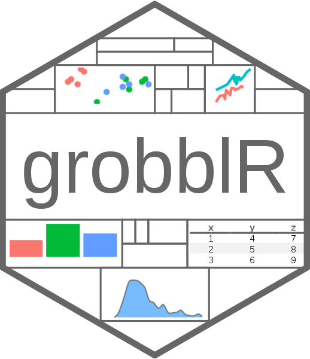

<!-- README.md is generated from README.Rmd. Please edit that file -->

```{r, include = FALSE}
knitr::opts_chunk$set(
  collapse = TRUE,
  comment = "#>",
  fig.path = "man/figures/README-",
  out.width = "65%"
)
```

# grobblR 

<!-- badges: start -->
[](https://opensource.org/licenses/MIT)

[](https://travis-ci.com/calvinmfloyd/grobblR)
<!-- badges: end -->

The grobblR package allows R users the ability to intuitively create flexible, reproducible PDF reports comprised of aesthetically pleasing tables, images, plots and/or text. This is done by implementing *grobs* from the `grid` and `gridExtra` packages.

Within grobblR, the objects able to be converted to a grob are:  

  * Data frames / matrices
      + Or a vector of values
  * `ggplot2` objects
  * A file path or a URL to a .png image
  * Character strings
  * Empty space (represented with `NA`)

[Example reports](https://github.com/calvinmfloyd/grobblR/tree/master/examples/reports) created by grobblR.

## Installation

You can install the latest version on [CRAN](https://CRAN.R-project.org/package=grobblR) with

``` r
install.packages("grobblR")
```

***

## Grob Layout

* We decided on a Shiny-like bootstrap method to arrange grobs, which would incorporate nested grob-rows (a row combining one or several grobs) and grob-columns (a column combining one or several grobs) within an overall layout of grobs (which we will call a grob-layout).
* The main grob-layout function evaluates the overall dimensions of the page you desire, and then distributes heights and widths to the grobs that will make up the page, based on proportions and the amount of grob-rows (`grob_row()`) and grob-columns (`grob_col()`) within the overall grob-layout (`grob_layout()`).
* For example, if we wanted to do a simple `2 x 2` grid system on a `100mm x 100mm` (millimeters is the default unit in grobblR) page, we would simply write:

```{r two_by_two_system}
library(grobblR)
 
grob_layout(
  grob_row(grob_col(1), grob_col(2)),
  grob_row(grob_col(3), grob_col(4)),
  height = 100,
  width = 100
  ) %>%
  view_grob()
```

* The `grob_row()`'s tell the `grob_layout()` that the user wants two rows on the outermost layer, and since there are two `grob_col()`'s within each of the `grob_row()`'s, the result is a `2 x 2` grid.
* But the result doesn't have to be a nice `2 x 2` grid - we could have a layout where the first row has two columns and the second has one:

```{r two_by_three_system}
grob_layout(
  grob_row(grob_col(1), grob_col(2)),
  grob_row(grob_col(3)),
  height = 100,
  width = 100
  ) %>%
  view_grob()
```

* Run `vignette("grob_layout")` for more information on `grob_layout()`.

## Nested Rows and Columns

* One of the ways that makes grobblR truly flexible is the ability to create "nested" rows and columns - where we can insert grob-rows into grob-columns, and vice-versa.
* This is made possible by incorporating the active classes within the [R6](https://CRAN.R-project.org/package=R6) package.
* The below grob-layout has a second grob-column in the second grob-row which contains two grob-rows within it:

```{r two_by_two_system_w_borders}
grob_layout(
  grob_row(
    border = TRUE,
    grob_col(border = TRUE, 1),
    grob_col(border = TRUE, 2)
    ),
  grob_row(
    border = TRUE,
    grob_col(border = TRUE, 3),
    grob_col(
      border = TRUE,
      grob_row(border = TRUE, grob_col(border = TRUE, 4)),
      grob_row(border = TRUE, grob_col(border = TRUE, 5))
      )
    ),
  height = 100,
  width = 100
  ) %>%
  view_grob()
```

## Size Control

* One way to control heights and widths of the grobs is by tweaking the `p` (standing for *proportion*) parameter within both `grob_row()` and `grob_col()`.
* The default for `p` is 1, but sizes change if `p` differs from that.

```{r two_by_one_system_all_p}
grob_layout(
  grob_row(p = 1, border = TRUE, grob_col('1')),
  grob_row(p = 2, border = TRUE, grob_col('2')),
  height = 100,
  width = 100
  ) %>%
  view_grob()
```

* The grob-row with `p = 2` is given twice the height of the grob-row with `p = 1`.
* The user can also supply specific heights/widths in millimeters.

```{r three_by_one_specific_heights}
grob_layout(
  grob_row(height = 25, border = TRUE, grob_col('1')),
  grob_row(height = 50, border = TRUE, grob_col('2')),
  grob_row(height = 25, border = TRUE, grob_col('3')),
  height = 100,
  width = 100,
  padding = 0
  ) %>%
  view_grob()
```

* Or the user can use a combination of specific heights and proportions to size the grobs:

```{r three_by_one_system_combo}
grob_layout(
  grob_row(p = 3, border = TRUE, grob_col('1')),
  grob_row(height = 50, border = TRUE, grob_col('2')),
  grob_row(p = 1, border = TRUE, grob_col('3')),
  height = 100,
  width = 100
  ) %>%
  view_grob()
```

## Matrix Grobs

* Using the `aes_list` parameter and the `ga_list()` function within `grob_col()`, the aesthetics of individual grobs can be adjusted to how the user intends them to appear.
* Run `?grobblR::ga_list` for a full list and description for each of the possible aesthetic options.
* For uniform background color for each cell in a matrix, one option is inputting a single value for `background_color` as an element within `aes_list`:


```{r first_matrix}
mat = matrix(1:4, nrow = 2, byrow = TRUE)

grob_layout(
  grob_row(grob_col(mat, aes_list = ga_list(background_color = "gray90"))),
  height = 100,
  width = 100
  ) %>%
  view_grob()
```

* If the user wants different cells of the matrix to have different aesthetics, the user can utilize `grob_matrix()` and `alter_at()`.
* The use can alter specific cells / groups of cells, and different aesthetics with `alter_at()` once the `grob_matrix()` object is initialized.
* Run `vignette("grob_matrix")` for more information on `grob_matrix()`.

```{r alter_at}
mat %>%
  grob_matrix() %>%
  alter_at(~ "red", columns = 1, aesthetic = "text_color") %>%
  alter_at(~ "blue", columns = 2, rows = 2, aesthetic = "background_color") %>%
  alter_at(~ "white", columns = 2, rows = 2, aesthetic = "text_color") %>%
  view_grob()
```

## ggplot Grobs

* The `ggplot2` plot is stretched or squished depending on what the dimensions of the allotted space are:

```{r ggplot_grobs}
data(iris)
library(ggplot2)

gg1 = ggplot(
  data = iris, 
  mapping = aes(x = Sepal.Length, y = Sepal.Width, color = Species)
  ) +
  geom_point() +
  guides(color = FALSE)

gg2 = ggplot(
  data = iris,
  mapping = aes(x = Sepal.Length, y = Petal.Length, color = Species)
  ) +
  geom_point() +
  guides(color = FALSE)

grob_layout(
  grob_row(grob_col(gg1), grob_col(gg2)),
  grob_row(grob_col(gg1))
  ) %>%
  view_grob(height = 100, width = 100)
```

## Image Grobs

* Only images in .png format are allowed in grobblR. The user must provide either a valid file path or a valid URL to the image.
* If the user does not want to maintain the aspect ratio of the image and allow it to be stretched within its allotted space, `maintain_aspect_ratio = FALSE` must be inserted within the `aes_list` list.

```{r png_grobs}
grob_layout(
  grob_row(
    border = TRUE,
    grob_col(
      border = TRUE,
      'vignettes/kings_logo.png'
      ),
    grob_col(
      border = TRUE,
      aes_list = ga_list(
        maintain_aspect_ratio = FALSE
        ),
      'https://raw.githubusercontent.com/calvinmfloyd/grobblR/master/vignettes/kings_logo.png'
      )
    ),
  height = 100,
  width = 100
  ) %>%
  view_grob()
```

* Or the user can incorporate `grob_image()` and `add_structure()`.

```{r grob_image}
grob_layout(
  grob_row(
    border = TRUE,
    grob_col(
      border = TRUE,
      'vignettes/kings_logo.png'
      ),
    grob_col(
      border = TRUE,
      'https://raw.githubusercontent.com/calvinmfloyd/grobblR/master/vignettes/kings_logo.png' %>%
        grob_image() %>%
        add_structure("maintain_aspect_ratio", FALSE)
      )
    ),
  height = 100,
  width = 100
  ) %>%
  view_grob()
```

## Text Grobs

* grobblR handles long character strings by making the text as big as possible, while still being able to fit the text inside its allotted space.
* This results in automatically putting different words on different lines:

```{r simple_text_grob}
text = "The quick brown fox jumps over the lazy dog."

grob_layout(
  grob_row(
    border = TRUE,
    grob_col(
      border = TRUE,
      text
      )
    ),
  height = 100,
  width = 100
  ) %>%
  view_grob()
```

* The aesthetics of the text can be tweaked with `grob_text()` and `add_aesthetic()`.

```{r grob_text}
grob_layout(
  grob_row(
    border = TRUE,
    grob_col(
      border = TRUE,
      text %>%
        grob_text() %>%
        add_aesthetic("text_color", "blue") %>%
        add_aesthetic("font_face", "italic")
      )
    ),
  height = 100,
  width = 100
  ) %>%
  view_grob()
```

## Empty Space Grobs

* Empty space grobs in case the user needs to compact, or shift grobs around:

```{r empty_space_grob}
df = data.frame(letter = letters[1:5], col1 = 1:5, col2 = 5:1)

grob_layout(
  grob_row(
    border = TRUE,
    grob_col(df),
    grob_col(
      grob_row(grob_col(df)),
      grob_row(grob_col(p = 1/3, NA))
      ),
    grob_col(
      grob_row(grob_col(p = 1/3, NA)),
      grob_row(grob_col(df))
      )
    ),
  height = 100,
  width = 100
  ) %>%
  view_grob()
```

## Grob Layout to PDF

* The default values for the `height` and `width` parameters within `grob_layout()` are `280` millimeters and `216` millimeters, as these are the values needed to properly fit the grob-layout onto a piece of standard computer paper, portrait orientation. 
* Converting multiple grob-layout's into a single PDF report using `grob_to_pdf()`, with a file title and a meta data title:

```{r grob_to_pdf, eval=FALSE}
first_page_grob_layout = grob_layout(
  grob_row(
    border = TRUE,
    grob_col(df),
    grob_col(
      grob_row(grob_col(df)),
      grob_row(grob_col(p = 1/3, NA))
      ),
    grob_col(
      grob_row(grob_col(p = 1/3, NA)),
      grob_row(grob_col(df))
      )
    ),
  height = 100,
  width = 100
  )

second_page_grob_layout = grob_layout(
  grob_row(
    border = TRUE,
    grob_col(
      border = TRUE,
      text
      )
    ),
  height = 100,
  width = 100
  )

# grob_to_pdf(
#   first_page_grob_layout,
#   second_page_grob_layout,
#   file_name = file.path(tempdir(), "test.pdf"),
#   meta_data_title = "Test PDF"
#   )

# OR

grob_to_pdf(
  list(first_page_grob_layout, second_page_grob_layout),
  file_name = file.path(tempdir(), "test.pdf"),
  meta_data_title = "Test PDF"
  )
```


